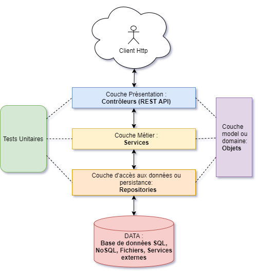
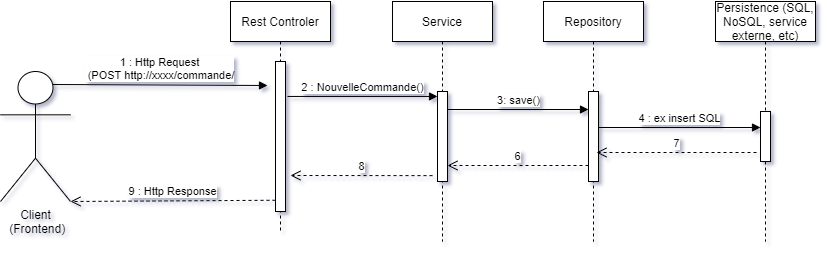

## [:house: Sommaire](../README.md)

avec shéma UML pour classe avec relations simples et exemples,
Use case pour services
sequence pour vue générale
parler de la structuration en package

# 10 - Conception avec UML

## :dart: Objectifs

- Comprendre ce qu'est UML et en quoi çà vous sera utile
- Interpréter et concevoir un diagramme de classe
- Interpréter et concevoir un diagramme de cas d'utilisation

## :toolbox: Définitions et Concepts

UML est un standard informatique datant de 1997 et crée par l'Object Management Group. Il intervient dans la partie conception durant le processus de cycle de vie de la gestion d'un logiciel (Conception, développement, tests, déploiement, maintenance).

C'est un outil de communication avec une syntaxe assez visuelle très poussée centrée sur des diagrammes qui permet une représentation précise des concepts métiers et des choix architecturaux.

Il est utilisé dans beaucoup de projets afin de réprésenter des idées, des concepts avec une représentation qui permet de définir les besoins avec des utilisateurs techniques ou non.

Il est très lié avec le paradigme de programmation objet et c'est en celà qu'il va sourtout nous servir. 
Nous allons nous focaliser sur 2 types de diagrammes qui nous serviront de guide avant de coder.

Avant de construire une maison on fait de plans non ? ET bien avant de coder un logiciel aussi, et ce sera avec UML en utilisant le logiciel StarUML.

J'utilise ici un système de diagrammes compatible avec la syntaxe markdown : mermaid. Je vous recommande d'apprendre à vous en servir car vous pourrez définir vos shémas rapidement dans le texte affiché par GitHub.

https://mermaid.js.org/intro/syntax-reference.html

### Diagramme de classe

**Classe**

**Méthodes (Opérations dans UML)**

StarUML add parameters sur l'opération
pour le retour il faut choisir "return" dans direction

**Héritage et implémentation d'interfaces**

### Diagramme de cas d'utilisation

Un acteur représente un rôle joué par une entité externe (utilisateur humain, dispositif
matériel ou autre système) qui interagit directement avec le système étudié.
Un acteur peut consulter et/ou modifier directement l’état du système, en émettant et/ou
en recevant des messages susceptibles d’être porteurs de données.

Une bonne recommandation consiste à faire prévaloir l’utilisation de la forme graphique
du
stick man
pour les acteurs humains et une représentation rectangulaire pour les
systèmes connectés.

Le cadre représente la frontière du systeme fonctionnel ou technique représenté

Mob=ntrer héritage avec exemple authentification

## :writing_hand: Travaux pratiques 

### TP1 :star:

## :speech_balloon: A retenir

## :link: Recherches Web 

### Site Officiel

### Site de Champions

### Pour aller plus loin