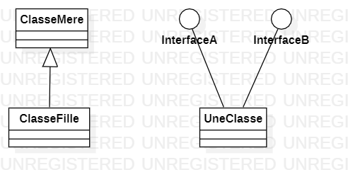
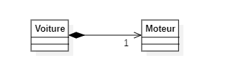

## [:house: Sommaire](../README.md)

# 9 - Conception avec UML

## :dart: Objectifs

- Comprendre ce qu'est UML et en quoi çà vous sera utile
- Interpréter et concevoir un diagramme de classe
- Interpréter et concevoir un diagramme de cas d'utilisation

## :toolbox: Définitions et Concepts

UML est un standard informatique datant de 1997 et crée par l'Object Management Group. Il intervient dans la partie conception durant le processus de cycle de vie de la gestion d'un logiciel (Conception, développement, tests, déploiement, maintenance).

C'est un outil de communication avec une syntaxe assez visuelle très poussée centrée sur des diagrammes qui permet une représentation précise des concepts métiers et des choix architecturaux.

Il est utilisé dans beaucoup de projets afin de réprésenter des idées, des concepts avec une représentation qui permet de définir les besoins avec des utilisateurs techniques ou non.

Il est très lié avec le paradigme de programmation objet et c'est en celà qu'il va sourtout nous servir. 
Nous allons nous focaliser sur 2 types de diagrammes qui nous serviront de guide avant de coder.

Avant de construire une maison on fait de plans non ? ET bien avant de coder un logiciel aussi, et ce sera avec UML en utilisant le logiciel StarUML.

J'utilise ici un système de diagrammes compatible avec la syntaxe markdown : mermaid. Je vous recommande d'apprendre à vous en servir car vous pourrez définir vos shémas rapidement dans le texte affiché par GitHub.

https://mermaid.js.org/intro/syntax-reference.html


### Diagramme de classe

**Classe et ses attributs**


**Classe est ses méthodes (Opérations dans UML)**

StarUML add parameters sur l'opération
pour le retour il faut choisir "return" dans direction


**Héritage et implémentation d'interfaces**



**Relations d'associations entre Classes**

- Les relations sont représentées avec un trait qui relie les 2 classes concernées.

- Les extrémités du trait peuvent avoir ou non :
  - une petite flèche (à ne pas confondre avec celle de l'héritage qui est pleine et blanche)
  - un losange
  - du texte indiquant la cardinalité : 1 ou 0.* par exemple.
  
Voyons à quoi tout çà ressemble avec le code Java en regard :

### Relations unidirectionelles (ou association dirigée)

*Une seule des 2 classes contient une référence (un attribut) vers la classe associée.*

**Une voiture ne peut avoir q'un propriétaire**


``` java
public class Voiture {
	private Proprietaire unProprietaire;
}

public class Proprietaire {
}
```

**Une Ville a zéro ou plusieurs habitants**


``` java
public class Ville {	
private List<Habitant> habitants;
}

public class Habitant {
}
```

### Relations bidirectionelles

*Les 2 classes contiennent chacunes une référence vers l'autre classe.*

**Un proprietaire peut avoir plusieurs voiture et une voiture ne peut avoir qu'un propriétaire.**


``` java
public class Proprietaire {
	private List<Voiture> mesVoitures;
}
public class Voiture {
	private Proprietaire unProprietaire;
}
```

### Relations de composition

*C'est un cas particulier d'association qui exprime une relation de contenance. L'idée est que si l'objet conteneur est détruit,  ceux contenus aussi. Nous n'allons pas l'utiliser mais je vous le présente quand même. On peut ou pas représenter cette notion de compostion via une classe imbriquée (nested class). Notez que le symbole de composition est placé du coté du contenant.*



``` java
public class Voiture {

	private Moteur moteur;

	private static class Moteur {
	}
}
```

### Diagramme de cas d'utilisation

- Les diagrammes de cas d'utilisation sont utilisés pour représenter le comportement fonctionnel d'un système logiciel.

- Le cadre représente la frontière du système fonctionnel ou technique étudié.

- Un cas d'utilisation (use case), de forme ovale, représente les interactions entre un utilisateur (humain ou machine) et le système représenté.

- Un cas d'utilisation peut avoir une relation de type ``<<include>>`` avec un autre cas d'utilisation. Celà signifie qu'un cas d'utilisation donné nécessite celui qui est pointé par la flèche pour être utilisé.

- Un acteur (Stickman) représente un rôle joué par une entité externe (utilisateur humain, dispositif, matériel ou autre système) qui interagit directement avec le système étudié. Dans le cas où l'acteur est un système, on préfixe par exemple de ``<<Système>>`` ou ``<<Service>>`` le nom de cet acteur pour bien l'identifier en tant que tel.

- Un acteur peut hérité d'un autre, c'est ç dire qu'il peut utiliser tous les cas d'utilisations de celui qui est pointé par la flèche.

-Concrètement, un diagramme de cas d'utilisation deviendra une interface Java avec des méthodes qui exploitent les classes métiers modélisées, cette interface sera implémentée ensuite suivant les besoins du systèmes (stockage en base de données avec Pattern Repository (vu ch10), appel de web services externes, de librairies spécialisées (ex IA, outils d'imageries, etc)). 

**Maintenant, analysez le diagramme ci-dessous et retrouvez les éléments décris plus haut.**


## :writing_hand: Travaux pratiques 

2 TPs afin de vous permettre de prendre en main StarUml et d'essayer de commencer par de la conception avant de coder.

### TP1 :star: :star:

A partir des explications suivantes :
1. Créez un Diagramme de Classes et un diagramme de cas d'utilisations
2. Implémentez le code en Java avec le modèle dans un package co.simplon.poo.ch9.tp1.model et la ou les interfaces dans co.simplon.poo.ch9.tp1.service.


-On a des personnes caractérisées par un nom, un prénom, métier et experience en année.
-Ces personnes peuvent être soit des salariés ou des prestataires(caractérisés par un tarif journalier moyen).
-Ces personnes travaillent toutes sur un ou plusieurs projets.
-Un projet est caractérisé par une date de début et de fin (utilisez le type LocalDate), un etat fini ou non, et une liste de taches.
-Une tache est caractérisée par éventuellement une tache précédente et une suivante, un etat (a faire, en cours, terminé), le temps passé en jours et du texte.

Le système devra permettre aux salariés de :

-Creer et supprimer des projets
-Associer un prestataire à un projet
-Ajouter des taches à un projet

Et pour les prestataires

-Changer l'état d'une tache
-voir la rémunération qu'on leur doit.

### TP2 :star: :star:

Code vers diagramme de classes et use cases:

Analysez le code du package co.simplon.poo.ch9.tp2 puis fabriquez les diagrammes correspondants.

## :speech_balloon: A retenir

- Un projet part généralementd'un besoin spécifié oralement ou à l'écrit, nous verrons plus tard certaines méthodologies agiles.
- Il est important de bien comprendre le jargon métier des demandeurs.
- Il est nécessaire de faire reformuler les demandeurs et de leur proposer plusieurs interprétations et ne pas s'arquebouter sur son biais technique.
- Le code permet seulement de valider que çà fonctionne dans un langage donné.
- Le plus important reste les shémas produits par l'analyse, car on peut repartir sur un autre langage/framework très simplement.

### Pour aller plus loin

Renseignez vous sur les diagrammes de sequence et diagrammes d'activité.

Intégrez les phase du Software Development Lifecycle

https://en.wikipedia.org/wiki/Systems_development_life_cycle


